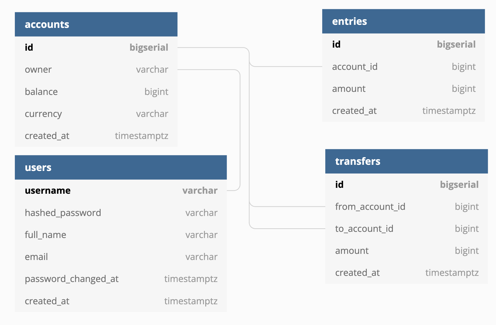

# Simple Bank


a simple bank service built with Golang (`gin`), `PostgreSQL`, [sqlc](https://github.com/sqlc-dev/sqlc).

## Introduction
- Easy to maintain, preferment also type-safe code for query generated from [sqlc](https://github.com/sqlc-dev/sqlc).
- Structured and dependency injection with [uber-go/fx](https://github.com/uber-go/fx)
- Test-driven development style with high test coverage using `golang/mock`
- Token-based authentication using [PASETO](https://github.com/paragonie/paseto).
- Containerized service, easy to run with [docker-compose](https://docs.docker.com/compose/)
- use env var file for config with [Viper](https://github.com/spf13/viper)
- RESTful API with auto generated api doc with [swaggo/swag](https://github.com/swaggo/swag)

## Functions
- User can create a `User` based on unique `username` and `email`.
- A log-in `User` can create multiple accounts with different currencies.
- Record all account balance changes in `Entry` table. Whenever some money is added to or subtracted from the account, an account entry record will be created.
- `/transfer` api, provide a money transfer function between 2 accounts. This happen **within a transaction** and transfer is thread-safe operation.

## Start the service
### Build and run the service
```bash
docker-compose up --force-recreate --build api
```

### Play Manually with Postman
1. check [http://localhost:8080/swagger/index.html](http://localhost:8080/swagger/index.html) for API doc
2. install [Postman](https://www.postman.com/)
3. import [postman-cmds.json](./postman-cmds.json)
4. have fun
    1. create user
    2. login
    3. JWT header: after login, copy the `access_token` in response and update variable the `auth header` with `bearer {access_token}`

## Database Schema



## Setup local development

### Run Local Infra with dev server
```bash
docker-compose -f docker-compose.infra.yaml up -d
go run main.go
```

### Install tools
- [Docker desktop](https://www.docker.com/products/docker-desktop)
- [TablePlus](https://tableplus.com/)
- [Golang](https://golang.org/)
- [Migrate](https://github.com/golang-migrate/migrate/tree/master/cmd/migrate)
    - if you want to create migration e.g. [step 15](#15-add-users-table-with-unique--foreign-key-constraints-in-postgresql)
- [Sqlc](https://github.com/kyleconroy/sqlc#installation)
    - if you want to generate go code from sql
- [Gomock](https://github.com/golang/mock)
    - if you want to generate mock code

### How to generate code

- Generate SQL CRUD with sqlc:

    ```bash
    make sqlc
    ```

- Generate DB mock with gomock:

    ```bash
    make mock
    ```

- Create a new db migration:

    ```bash
    migrate create -ext sql -dir db/migration -seq <migration_name>
    ```

---

## Dev Progress
### 1. Setup local environment

### 2. Design [dbdiagram](./db/dbdiagram) with https://dbdiagram.io/
- Foreign Key: `ref: > A.id`, 
- Timestamp Type: `timestamptz`
- Generate sql [000001_init_schema.up.sql](./db/migtation/000001_init_schema.up.sql)

### 3. Setup Postgres with Docker and DB Migration
```bash
docker-compose -f docker-compose.infra.yaml up -d
docker exec -it <CONTAINER_ID> psql -d simple_bank -U root
```
- now we should be able to see tables created by migration script
- we can also connect DB with [TablePlus](https://tableplus.com/)

### 4. Generate CRUD Golang code from SQL
- Write CRUD SQL query in [db/query](./db/query)
- generate golang code with `make sqlc`
- init go module `go mod init github.com/hhow09/simple_bank`

### 5. Write Golang unit tests for database CRUD with random data
- Write tests
    - [main_test.go](./db/sqlc/main_test.go): to make db connection
    - use `testQueries` to access functions in `[query].sql.go`
    - write following tests
    - [account_test.go](./db/sqlc/account_test.go)
    - [entry_test.go](./db/sqlc/entry_test.go)
    - [transfer_test.go](./db/sqlc/transfer_test.go)
- `make test`
- go [context](https://pkg.go.dev/context): carries deadlines, cancellation signals, and other request-scoped values across API boundaries and between processes.

### 6. implement database transaction in Golang
- Create [store.go](./db/sqlc/store.go)
    - `Store`: provides all funcs to execute queries and transactions
    - `execTx`: define a private transaction function: begin -> Commit or Rollback
    - `TransferTx`: define a public transfer transaction function
        1. create transfer record
	    2. create Entry of from_account
	    3. create Entry of to_account
        4. update accounts' balance
- Write [store_test.go](./db/sqlc/store_test.go)
    - create 5 goroutine to test transaction
    - get the err and result with go [channel](https://tour.golang.org/concurrency/2)
### 7. Handle Transaction Lock
- Now transfer transaction will not pass the test since
    - `GetAccount` SQL is `SELECT` and does not block each other
    - it will result in all concurrent `GetAccount` just return initial value
- Create a SQL that `SELECT FOR UPDATE`
    ```
    -- name: GetAccountForUpdate :one
    SELECT * FROM accounts
    WHERE id = $1 LIMIT 1;
    FOR UPDATE
    ```
    
#### Deadlock
```sql
BEGIN;
INSERT INTO transfers (from_account_id, to_account_id, amount) VALUES (1, 2, 10) RETURNING *: -- exclusive lock on accounts

INSERT INTO entries (account_id, amount) VALUES (1, -10) RETURNING
INSERT INTO entries (account_id, amount) VALUES (2, 10) RETURNING *;
SELECT * FROM accounts WHERE id = 1 FOR UPDATE;
UPDATE accounts SET balance = 90 WHERE id = 1 RETURNING *;

SELECT * FROM accounts WHERE id = 2 FOR UPDATE; -- exclusive lock on accounts
UPDATE accounts SET balance = 110 WHERE id = 2 RETURNING *;
COMMIT;
```
- since `transfers` Table has foreign key `from_account_id` and `to_account_id` referencing `accounts` Table
- `INSERT INTO transfers` will acquire a `RowExclusiveLock` on accounts Table to ensure that ID of accounts are not consistent.
- `SELECT * FROM accounts ... FOR UPDATE` will also acquire a lock on accounts

### Deadlock happens
| TX1                                   	| TX2                                   	|                                    	|
|---------------------------------------	|---------------------------------------	|------------------------------------	|
| BEWGIN                                	|                                       	|                                    	|
|                                       	| BEGIN                                 	|                                    	|
|                                       	| INSERT INTO TRANSFERS                 	| TX2 lock on account table          	|
|                                       	| INSERT INTO ENTRIES                   	|                                    	|
|                                       	| INSERT INTO ENTRIES                   	|                                    	|
| INSERT INTO TRANSFERS                 	|                                       	| TX1 lock on account table          	|
|                                       	| SELECT * FROM accounts ... FOR UPDATE 	| waiting lock from TX1              	|
| INSERT INTO ENTRIES                   	|                                       	|                                    	|
| INSERT INTO ENTRIES                   	|                                       	|                                    	|
| SELECT * FROM accounts ... FOR UPDATE 	|                                       	| waiting lock from TX2<br>deadlock! 	|

### Solution
- we are only update the `balance` of account. The lock is unneeded.
- change: `FOR UPDATE` -> `FOR NO KEY UPDATE`
- Refactor 
    - `getAccountForUpdate`+`UpdateAccount` = `AddAccountBalance`


### 8. Avoid DeadLock
- We will encounter deadlock when 2 transactions: `acc1` -> `acc2` and `acc2` -> `acc1` are running concurrently.
```sql
-- gorutine 1: transfer from id=1 to id=2
BEGIN;
UPDATE accounts SET balance = balance - 10 WHERE id = 1 RETURNING *;
UPDATE accounts SET balance = balance + 10 WHERE id = 2 RETURNING *; 
COMMIT; 

-- gorutine 2: transfer from id=2 to id=1
BEGIN;
UPDATE accounts SET balance = balance - 10 WHERE id = 2 RETURNING *; 
UPDATE accounts SET balance = balance + 10 WHERE id = 1 RETURNING *;
COMMIT; 
```

- However if we switch the order so that **transactions always acquire locks in a consistent order**
```golang
if arg.FromAccountID < arg.ToAccountID {
	result.FromAccount, result.ToAccount, err = addMoney(ctx, q, arg.FromAccountID, -arg.Amount, arg.ToAccountID, arg.Amount)
} else {
	result.ToAccount, result.FromAccount, err = addMoney(ctx, q, arg.ToAccountID, arg.Amount, arg.FromAccountID, -arg.Amount)
}
```

the deadlock will not happen.
- we can test with `TestTransferTxDeadlock`

### 9. Isolation levels & read phenomena in MySQL & PostgreSQL 

#### MySQL
```sql
SELECT @@transaction_isolation --isolation level of current session
SELECT @@global.transaction_isolation --isolation level of global session
```

#### PostgreSQL
- only has 3 isolation level since `read uncommitted` is actually `read committed`
- transaction isolation can only be set in one transaction.
```sql
show transaction isolation level;
```
#### repeatable read is different in MySQL and PostgreSQL
- in isolation level `repeatable read`

```
Table accounts
 id  | owner  | balance | currency |          
-----+--------+---------+----------+
   1 | tom    |     100 | USD      |
   2 | mary   |     100 | USD      |
```

```
Steps:
1. process A, select * from accounts: tom's balance = 100
2. process B, select * from accounts where id=1: tom's balance = 100
3. process A, update accounts set balance = balance - 10 where id=1 returning *; tom's balance = 90
4. process B, select * from accounts where balance >=100: tom will appear since tom's balance = 100, (repeatable read)
5. process A, commit; 
6. process B, update accounts set balance = balance - 10 where id=1 returning *; 
7. process B, commit;
```

- running those steps in MySQL:
    - after step 7 we will get tom's balance: 80
    - however it does not make sense since we expect tom's balance to be 100
- running those steps in MySQL:
    - after step 6 we will get `ERROR:  could not serialize access due to concurrent update`

#### MySQL v.s. PostgreSQL
|                         | MySQL         | PostgreSQL           |
|-------------------------|---------------|----------------------|
| isolation levels        | 4             | 3                    |
| mechanism               | lock          | dependency detection |
| default isolation level | read commited | repeatable read      |

#### Reference
- [MySQL - 15.7.2.1 Transaction Isolation Levels](https://dev.mysql.com/doc/refman/8.0/en/innodb-transaction-isolation-levels.html)
- [PostgreSQL - 13.2. Transaction Isolation](https://www.postgresql.org/docs/current/transaction-iso.html)

### 10. Github Action For unit test
- [.github/workflows/test.yml](./.github/workflows/test.yml)

### 11. Implement RESTful HTTP API in Go using Gin
- install [gin-gonic/gin](https://github.com/gin-gonic/gin) for http router and implement REST API
- in [api](./api)
    - define routing and handlers
    - use [Model binding and validation](https://github.com/gin-gonic/gin#model-binding-and-validation) to do param validation.

### 12. Load config from file & environment variables in Golang with [Viper](https://github.com/spf13/viper)
- default config [app.env](./app.env)
- env var can be further override with `environment` in [docker-compose.yaml](./docker-compose.yaml) >

### 13. Mock DB for testing HTTP API in Go and achieve 100% coverage
- We need a mockDB
#### Currently Server is using `store` of real db
```golang
type Server struct {
	store  *db.Store
    ...
}
```
- we can generate `Querier` interface by setting`emit_interface: true`
    - `var _ Querier = (*Queries)(nil)` means `Queries` struct must implement `Querier` interface
- we can make a higher level abstraction `Store` interface
    - we can embed `Querier` interface in to `Store` to ensure it has all 
    - `SQLStore` must implements `Store`
- `make mock`
    - package name: `mockdb`
    - destination `db/mock/store.go` 
    - Interface to mock: `Store`
- write tests in [account_test.go](./api/account_test.go) using `store *mockdb.MockStore`
    - use [httptest.NewRecorder](https://pkg.go.dev/net/http/httptest#NewRecorder) and `router.ServeHTTP` to write test and record them.
    - achieve 100%

### 14.  Implement transfer money API with a custom params validator
- implement `POST /transfers` API
    - instead of hard code the available currency in param binding, register a custom currency validator to gin
    - use `ShouldBindJSON` in `*gin.Context` to parse JSON
    - validate requested transfer currency should match two accounts

### 15. Add users table with unique & foreign key constraints in PostgreSQL
- now we still missing user authentication and authorization, we need user Tables.
- modify [dbdiagram](./db/dbdiagram) to add user Table, some db constraints:
    - email should be `unique`
    - a user can have multiple account: `accounts.owner` should be the foreign key of username.
    - an owner cannot own two account with same currency: 
        - `(owner, currency) [unique]`
        - `ALTER TABLE "accounts" ADD CONSTRAINT "owner_currency_key" UNIQUE ("owner", "currency");`
- generate postgreSQL script from https://dbdiagram.io/
- `migrate create -ext sql -dir db/migration -seq add_users` to add a new migration script, [000002_add_users.up.sql](./db/migration/000002_add_users.up.sql)
- `make migratedown`

### 16. How to handle DB errors in Golang correctly
- `make sqlc` to generate updated model and `*.sql.go` 
- write unit test [user_test.go](./db/sqlc/user_test.go)
- handle db constraints violation in `CreateAccount`
    - `foreign_key_violation`: an account should only be created **when owner is an existing user**
    - `unique_violation`: an `owner-currency` index should be unique
    - both of them should return `http.StatusForbidden` (403)

### 17. How to securely store passwords? Hash password in Go with Bcrypt!
- use [bcrypt](https://pkg.go.dev/golang.org/x/crypto/bcrypt) to do password hashing and checking in [password.go](./util/password.go)
    - bcrypt will generate hashed password with `cost` `random salt` 
    - if we hash same password twice, output should be different
- implement `createUser` handler in [user.go](./api/user.go).
    - check [go-playground/validator - Baked-in Validations](https://github.com/go-playground/validator#baked-in-validations).

### 18. How to write stronger unit tests with a custom gomock matcher
- [user_test.go](./api/user_test.go)
    - first `randomUser()` to generate a random `user` as input
    - compare the input `user` with API result, the password part should be checked with custom matcher since hashing 2 times will generate different result.

### 19. [PASETO](https://github.com/paragonie/paseto) better than JWT
#### JWT
- composed of: `base64(Header)` + `base64(Payload)` + `base64(Signature)`
- for local use
    - symmetric digital signature algorithm: use same secrete key to sign and verify
- for public use
    - asymmetric digital signature algorithm: use private key to sign token and public key to verify token.
- cons: some algorithms are known to be vulnerable
- cons: prone to **trivial token forgery**: 
    - Send a header that specifies the `none` algorithm be used
    - Send a header that specifies the `HS256` algorithm when the application normally signs messages with an RSA public key.
#### PASETO
- [A Thorough Introduction to PASETO](https://developer.okta.com/blog/2019/10/17/a-thorough-introduction-to-paseto)
- similar to JWT
- for local use
    - symmetric encryption: use same secrete key to sign and verify
    - composed of: `Version` + `local` + `encrypted(Payload)` + `base64(Footer)`
    - Payload: `data` + `expiration date` + `Nonce` + `Auth Tag`
- for Public use
    - symmetric encryption: use same secrete key to sign and verify
    - composed of: `Version` + `public` + `base64(signed string)` 
- Pros: Stronger algorithms than JWT.
- Pros: No trivial forgery since you don't need to choose algorithm.
- Pros: local `Payload` is encrypted, there won’t be any way for attackers to see any of your payload data without your secret key.

### 20. How to create and verify JWT & PASETO token in Golang
- [token](./token) package

### 21. Implement login user API that returns PASETO or JWT access token in Go
- add config of `TOKEN_SYMMETRIC_KEY` and `ACCESS_TOKEN_DURATION` as server config
- setup [loginUser](./api/user.go) API
- write test cases in [user_test.go](./api/user_test.go)

### 22. Implement authentication middleware and authorization rules in Golang using Gin
- setup [middleware.go](./api/middleware.go) and [middleware_test.go](./api/middleware_test.go) to setup token verification for routes
- setup `router.Group("/").Use(authMiddleware(server.tokenMaker))` in [server.go](./api/server.go)
- update the auth rules for apis
    - `createUser`: public
    - `CreateAccount`: auth middleware, a user can only create accounts it owns.
    - `getAccount`: auth middleware, can only see accounts created by the request user itself.
    - `listAccounts`: auth middleware, can only see accounts created by the request user itself.
        - add `WHERE owner = $1` for listAccount Query
    - `CreateTransfer`: auth middleware, fromAccount should be the account owned by user itself.
- update unit test with `setupAuth` 

### 23. Build a minimal Golang Docker image with a multistage Dockerfile
test the built simple_bank_api container in dev environment 
```bash
docker-compose -f docker-compose.infra.yaml up -d
docker-compose -f docker-compose.server-only.yaml up --force-recreate --build api
```

### 24. Use docker network to connect 2 stand-alone containers
- solved in `docker-compose.server-only.yaml`

### 25. write [docker-compose.yaml](docker-compose.yaml)
1. start db
2. run migration
3. start service

### 26. Generate API Doc with [swaggo/swag](https://github.com/swaggo/swag)
- `make swagger` then swagger files will be in [docs](./docs)
- run the app
- check http://localhost:8080/swagger/index.html

### 26. Dependency Injection using [uber-go/fx](https://github.com/uber-go/fx)
- reference: [dipeshdulal/clean-gin](https://github.com/dipeshdulal/clean-gin)
